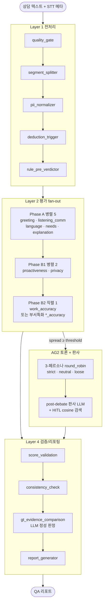
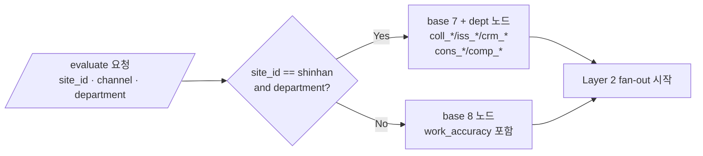

# V3 QA Pipeline — Multi-Tenant Inbound Consultation QA

> 인바운드 상담 QA 자동 평가 시스템 — LangGraph 4-Layer 멀티테넌트 + AG2 토론 + HITL RAG

신한카드 / 코오롱 등 업종별 다테넌트를 단일 파이프라인에서 처리하며, 8개 평가 노드 + 부서특화 노드의 fan-out, 의견 충돌 시 3-페르소나 AG2 토론, HITL(Human-in-the-Loop) 사례 RAG 기반 판사 LLM 평가까지 통합한다.

---

## 🏗️ 아키텍처

### 4-Layer 파이프라인



### 테넌트 라우팅 (Layer 2 fan-out 분기)



---

## 📦 패키지 구조

| 위치 | 역할 |
|---|---|
| `packages/agentcore-agents/qa-pipeline/` | **메인 백엔드** — LangGraph 그래프, 평가 노드, AG2 debate, HITL RAG |
| `packages/agentcore-agents/qa-pipeline/v2/serving/server_v2.py` | FastAPI HTTP/SSE 서버 (포트 8081) |
| `packages/agentcore-agents/qa-pipeline/v2/tenants/` | 테넌트별 YAML 설정 (`shinhan/`, `kolon/`) |
| `packages/agentcore-agents/qa-pipeline/v2/agents/shinhan_dept/` | 신한 부서특화 노드 레지스트리 (901-922) |
| `packages/agentcore-agents/qa-pipeline/v2/debate/` | AG2 토론 (team.py, run_debate.py) |
| `packages/agentcore-agents/qa-pipeline/v2/hitl/` | HITL RAG (qa-hitl-cases AOSS 검색) |
| `packages/agentcore-agents/qa-pipeline/v2/layer4/` | gt_comparison, gt_evidence_comparison, report_generator |
| `packages/agentcore-agents/qa-pipeline/deploy/` | EC2 인플레이스 배포 (provision/deploy/bootstrap) |
| `packages/chatbot-ui-next/` | **프론트엔드** — Next.js 16 + React 19 + Tailwind v4 |
| `packages/cdk-infra-python/` | AWS CDK 인프라 (Bedrock, OpenSearch, DynamoDB) |

---

## 🚀 로컬 실행

### Backend (포트 8081)
```bash
cd packages/agentcore-agents/qa-pipeline
python -m v2.serving.main_v2
curl http://localhost:8081/health
```

### Frontend (포트 3000)
```bash
cd packages/chatbot-ui-next
pnpm install
pnpm dev
```

브라우저: `http://localhost:3000`

---

## 🌐 EC2 배포

EC2 `i-01e0ee91f3c5f8bb4` (us-east-1, IP `98.86.146.113`) 에 SSM 경유 인플레이스 배포 — IP 보존.

```bash
cd packages/agentcore-agents/qa-pipeline
python deploy/deploy.py --target both       # 백엔드 + 프론트 동시
python deploy/deploy.py --target backend    # qa-pipeline 만
python deploy/deploy.py --target frontend   # chatbot-ui-next 만
python deploy/deploy.py --target bootstrap  # 최초 1회 EC2 셋업
```

배포 후:
- 프론트: http://98.86.146.113/
- 백엔드: http://98.86.146.113/api/health

---

## 🔬 배치 평가 (프롬프트 튜닝)

HTTP/SSE 우회 인프로세스 배치 — `graph.ainvoke()` 직접 호출.

```bash
cd packages/agentcore-agents/qa-pipeline
BATCH_OUTPUT_SUFFIX=iter01 \
BATCH_MAX_CONCURRENT=2 \
PER_SAMPLE_TIMEOUT=600 \
python scripts/run_direct_batch.py

# Self-Consistency: N회 median 병합
python scripts/merge_self_consistency.py --folders sc1 sc2 sc3 --output final
```

`QAState.plan.skip_phase_c_and_reporting=True` 주입 시 phase_b2 후 즉시 `__end__` (report/validation/consistency 생략).

---

## 🏢 테넌트 비교

| 항목 | 신한 (shinhan) | 코오롱 (kolon) |
|---|---|---|
| **계층** | 3단계 (site/channel/department) | 2단계 (site only) |
| **평가 항목** | 13개 base + 10 dept 노드 (#3/#11/#13/#15/#16 제외) | 18개 (#1-#18 전체) |
| **PII 정책** | strict (카드사) | standard (의류몰) |
| **Intent 11종** | 연체상담/카드발급/.../민원 | 상품문의/주문배송/.../일반문의 (10종) |
| **dept 분기** | `coll_*`/`iss_*`/`crm_*`/`cons_*`/`comp_*` 노드 fan-out | 없음 (base 8 고정) |
| **force_t3** | #9, #17, #18 | #9, #17, #18 (동일) |
| **만점** | 100점 (base 80 + dept 20+) | 100점 |

**라우팅 분기점** (`v2/graph_v2.py::_resolve_active_sub_agents`):
```python
if site_id == "shinhan" and department:
    return base_7_without_work_accuracy + dept_nodes
return base_8  # 코오롱 / 그 외 전부
```

---

## 🎭 AG2 토론 + HITL 판사

**Phase 2 (2026-04-23)** — 3-페르소나 round_robin 그룹채팅으로 의견 충돌 합의:
- **발동 조건** — 평가자 점수 spread ≥ threshold 항목
- **페르소나** — strict (엄격) / neutral (중립) / loose (관대)
- **post-debate 판사** — 토론 transcript + HITL 사례 cosine 검색 결과 종합 판정
- **HITL Step 0** — 강한 신호(cos≥0.7) 채택 / 약한 신호(0.5≤cos<0.7) 참조 / 사례 없음 시 일반 평가
- **5중 안전장치** — AG2 import/build/chat/item-level/score snap 실패 시 fallback_median
- **비활성화** — `QA_DEBATE_ENABLED=false`

SSE 이벤트: `debate_round_start / persona_speaking / persona_message / vote_cast / debate_final / discussion_finalized`

---

## 🛠️ 환경 변수

| 변수 | 용도 | 기본값 |
|---|---|---|
| `BEDROCK_MODEL_ID` | LLM 모델 | `us.anthropic.claude-sonnet-4-20250514-v1:0` |
| `SAGEMAKER_MAX_CONCURRENT` | LLM 동시 호출 상한 | `2` (Bedrock throttle 완화) |
| `BATCH_OUTPUT_SUFFIX` | 배치 결과 폴더 접미사 | `direct` |
| `BATCH_MAX_CONCURRENT` | 배치 병렬 샘플 수 | `2` |
| `PER_SAMPLE_TIMEOUT` | 샘플당 타임아웃(초) | `600` |
| `QA_DEBATE_ENABLED` | AG2 토론 on/off | `true` |
| `AWS_REGION` / `AWS_DEFAULT_REGION` | AWS 리전 | `us-east-1` |

---

## 🔧 코드 컨벤션

- **Python**: ruff (line 120, target 3.13, double quote, space indent). `pnpm lint:py` / `pnpm format:py`
- **TypeScript**: ESLint + Prettier. `pnpm lint` / `pnpm format`
- **Commits**: conventional commits (commitlint). `pnpm commit` 으로 commitizen 사용 가능
- **License**: Apache 2.0 — 모든 소스에 SPDX 헤더 필수
- **노드 추가 시** — `nodes/skills/constants.py` canonical 정의 import 사용 (DRY), 점수는 `snap_score()` 필수
- **LLM 노드 예외** — `await invoke_and_parse(...)` 블록에 `except LLMTimeoutError: raise` 를 generic 앞에 배치

상세: `CLAUDE.md`

---

## 📚 주요 산출물 / 참고

- `CLAUDE.md` — 코드베이스 가이드 (Claude Code 용 + 사람도 읽기 좋음)
- `DEVELOPER_GUIDE.md` — 개발자 온보딩
- `packages/chatbot-ui-next/DEPLOYMENT.md` — 프론트 배포 가이드
- `packages/agentcore-agents/qa-pipeline/deploy/README.md` — EC2 배포 가이드

---

## 🧪 검증

```bash
pytest tests/                                      # 전체
pytest tests/unit/test_orchestrator.py             # 단일 파일
```

테스트는 `_ensure_orch_path()` + `tests/conftest.py::load_module_from_path()` 로 에이전트 간 import 충돌 회피.

---

## 📜 License

Apache License 2.0 — see `LICENSE` (Amazon.com, Inc. or its affiliates).
