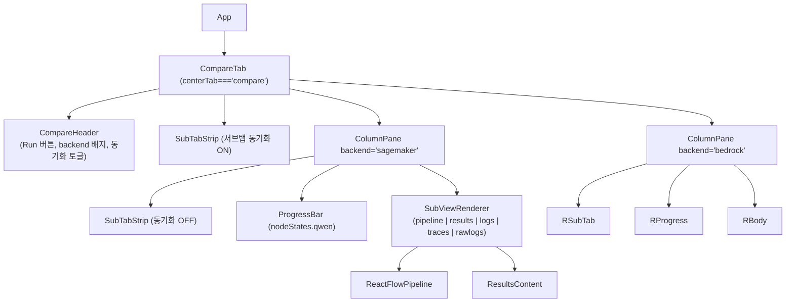

# 모델 비교 탭 설계 문서 (Task #1)

> 대상 파일: `packages/chatbot-ui/qa_pipeline_reactflow.html` (단일 HTML, React via ESM)
> 신규 탭: `centerTab === "compare"` — 좌(Qwen3-8B / sagemaker) / 우(Claude Sonnet 4.5 / bedrock) split view, 각 컬럼에 기존 5개 서브뷰(파이프라인 · 평가결과 · 에이전트로그 · 트레이스 · 상세로그) 전부 내장
> 제약: 단일 HTML 파일 유지, Tailwind/CSS 프레임워크 추가 금지, 기존 CSS 변수(`var(--blue)` 등) 재사용
> 비고: `ResultsContent` 는 `tab` prop 으로 4개 서브뷰(results/logs/traces/rawlogs)를 이미 라우팅함 → 재사용. 파이프라인(ReactFlow) 만 기존 코드에서 center-area 에 인라인이므로 컴포넌트화 필요.

---

## 1. 레이아웃 와이어

### 1.1 상단 탭 바 (기존 + 1개 추가)

```
┌─────────────────────────────────────────────────────────────────────────┐
│ 파이프라인 │ 평가결과 │ 에이전트로그 │ 트레이스 │ 로그(상세) │ Pentagon │ 모델 비교 ← NEW
└─────────────────────────────────────────────────────────────────────────┘
```

### 1.2 "모델 비교" 탭 내부 (centerTab === "compare")

```
┌─────────────────────────────────────────────────────────────────────────────────┐
│  ┌─ Compare Header ──────────────────────────────────────────────────────────┐ │
│  │ [▶ Run Both]  [sagemaker ●running 00:12.3]  [bedrock ○idle 00:00.0]       │ │
│  │ [□ 스크롤 동기화] [□ 서브탭 동기화]                                         │ │
│  └───────────────────────────────────────────────────────────────────────────┘ │
│  ┌─ Sub-tab strip (공통, "서브탭 동기화" ON 일 때만) ─────────────────────────┐ │
│  │ [파이프라인] [평가결과] [에이전트로그] [트레이스] [로그(상세)]              │ │
│  └───────────────────────────────────────────────────────────────────────────┘ │
│  ┌─ LEFT COLUMN (Qwen3-8B) ──────────┐ ┌─ RIGHT COLUMN (Sonnet 4.5) ────────┐ │
│  │  [서브탭 strip (동기화 OFF 시)]   │ │  [서브탭 strip (동기화 OFF 시)]    │ │
│  │  ─────────────────────────────    │ │  ─────────────────────────────     │ │
│  │  <ProgressBar nodeStates=qwen>    │ │  <ProgressBar nodeStates=bedrock>  │ │
│  │                                   │ │                                    │ │
│  │  [현재 서브탭 렌더]                 │ │  [현재 서브탭 렌더]                  │ │
│  │   - pipeline → ReactFlow          │ │   - pipeline → ReactFlow           │ │
│  │   - results  → ResultsContent     │ │   - results  → ResultsContent      │ │
│  │   - logs/traces/rawlogs → 〃      │ │   - logs/traces/rawlogs → 〃       │ │
│  │                                   │ │                                    │ │
│  │  ⟂ 세로 스크롤 (개별/동기)          │ │  ⟂ 세로 스크롤 (개별/동기)          │ │
│  └──────────────────────────────────┘ └────────────────────────────────────┘ │
└─────────────────────────────────────────────────────────────────────────────────┘
```

### 1.3 Mermaid — 컴포넌트 트리



---

## 2. State tree 분리안

### 2.1 현재 App()의 단일 state (L3182~3280)

```
실행 메타:     running, elapsed, errorAlert
파이프라인:    nodeStates, nodeTimings, nodeScores, nodeErrors, edgeStates
결과/스트림:   result, streamingItems
로그:          logs, traces, rawLogs
UI flash:      tabFlash
파생(useMemo): phaseAHighlight, phaseB1Highlight, phaseB2Highlight, isRunning
```

### 2.2 네임스페이스 설계 — **Custom hook 추출**

> **결론:** 객체 복제(`{qwen:{nodeStates,...}, bedrock:{...}}`)는 setter 경로가 전부 바뀌어 기존 15+개 setState 호출을 침습적으로 리팩터해야 함. Custom hook 으로 **런(run) 단위 state + action dispatcher** 를 뽑아, 두 인스턴스를 독립 생성하는 편이 기존 코드 영향이 작고 SSE 핸들러를 그대로 재사용 가능.

```js
// 신규 훅 시그니처
function usePipelineRun({ backend, serverUrl }) {
  // 내부에 기존 App의 런 관련 state 전체를 보유
  return {
    // --- state ---
    backend,                     // 'sagemaker' | 'bedrock'
    running, elapsed, errorAlert,
    nodeStates, nodeTimings, nodeScores, nodeErrors, edgeStates,
    result, streamingItems,
    logs, traces, rawLogs,
    tabFlash,
    // --- derived ---
    isRunning, phaseAHighlight, phaseB1Highlight, phaseB2Highlight,
    // --- actions ---
    start({ transcript }),       // 내부에서 fetch + SSE 파싱
    reset(),
    abort(),                     // AbortController.abort()
  };
}
```

- 기존 App 의 "단일 런" 로직은 `usePipelineRun({ backend: llmBackend })` 한 번 호출로 동일 재현 → **기존 5개 탭은 한 줄도 안 바뀜**.
- 비교 탭은 `const qwen = usePipelineRun({backend:'sagemaker'}); const bedrock = usePipelineRun({backend:'bedrock'});` 두 번 호출.
- 서버 URL / 트랜스크립트 / CSV 상태 / selectedNode(드로어) 등 **런과 무관한 입력/전역 UI** 는 App 에 그대로 유지.

### 2.3 공유 vs 독립 구분표

| 항목 | 공유(App 유지) | 독립(훅 인스턴스별) |
|---|---|---|
| serverUrl, transcript, uploadedFileName | ● | |
| csvState | ● | |
| selectedNode (NodeDrawer) | ● (드로어는 1개, 클릭된 컬럼 backend 태그 함께 보관: `{backend, nodeId}`) | |
| centerTab (상단 탭) | ● | |
| compareSubTab (비교 내부 서브탭 - 동기화 ON) | ● | |
| columnSubTab.qwen / .bedrock (동기화 OFF) | | ● |
| nodeStates, …, streamingItems, logs, traces, rawLogs | | ● |
| running, elapsed, errorAlert | | ● |

### 2.4 NodeDrawer 확장 (Q3 확정안 — state-api-dev 제안 채택)

**`selectedNode` shape 를 `{backend, nodeId} | null` 로 전면 통일.** 타협안(기존 탭은 nodeId, 비교 탭은 객체) 은 NodeDrawer 내부에서 분기가 생겨 복잡 → 전면 통일이 깔끔.

- **기존 단일 탭**: `single.selectNode(nodeId)` → 훅이 내부에서 `{backend: single.backend, nodeId}` 로 래핑해 App 의 `setSelectedNode` 에 전달.
- **비교 탭**: `qwen.selectNode(nodeId)` → `{backend:'sagemaker', nodeId}`. `bedrock.selectNode(nodeId)` → `{backend:'bedrock', nodeId}`.
- **NodeDrawer**: `selectedNode.backend` 로 `single` / `qwen` / `bedrock` 중 맞는 훅 인스턴스의 `nodeStates/nodeTimings/nodeScores/nodeErrors/result/streamingItems` 를 조회. App 이 3개 훅 참조를 `backend → runInstance` 맵으로 전달.

---

## 3. 동기화 전략

### 3.1 Run 동작

```js
const handleRunBoth = () => {
  if (!transcript.trim()) return;
  qwen.start({ transcript });       // await 안 함 — 병렬
  bedrock.start({ transcript });
};
```

- 두 훅 인스턴스는 **완전 독립 fetch + ReadableStream reader**. 동시 시작, 독립 종료.
- Run 버튼 disabled 조건: `!transcript.trim() || (qwen.running && bedrock.running)`.
- 한쪽만 실행하기: 배지를 클릭 가능하게 만들어 `qwen.start()` / `bedrock.start()` 단독 호출 (optional, UX 옵션 참조).

### 3.2 실패 격리

- `usePipelineRun.start()` 내부 try/catch 는 **자기 훅 인스턴스의 errorAlert 에만** 쓰기. 상대 훅에 영향 없음.
- 한쪽이 fetch 거부(서버 다운/SigV4 실패)해도 다른 쪽 SSE 는 계속 진행.
- 각 훅이 `AbortController` 소유 → `reset()` 호출 시 자기 것만 abort.

### 3.3 CSS scoping (컬럼 충돌 방지)

기존 CSS 중 `.graph-container`, `.center-panel-content`, `.tabs-bar`, `.progress-bar` 등은 전역 셀렉터. 비교 탭에서는 동일 마크업이 **2번** 등장하므로 충돌 가능. 대응:

```css
/* 비교 탭 전용 스코프 — 기존 스타일 건드리지 않음 */
.compare-root { display: grid; grid-template-columns: 1fr 1fr; gap: 12px; }
.compare-col  { min-width: 0; min-height: 0; display: flex; flex-direction: column; overflow: hidden; border: 1px solid var(--panel-border); border-radius: 8px; }
.compare-col[data-backend="sagemaker"] { border-left: 3px solid var(--blue); }
.compare-col[data-backend="bedrock"]   { border-left: 3px solid var(--green); }
.compare-col .graph-container   { height: 100%; min-height: 420px; }
.compare-col .center-panel-content { padding: 8px; }
.compare-col .tabs-bar .tab-btn { padding: 6px 10px; font-size: 12px; }  /* 좁은 폭에서 줄바꿈 방지 */
```

**ReactFlow 인스턴스 취급 (frontend-impl 피드백 반영)**
- `key={backend}` 는 **컬럼별로 고정 값**이라 교차 리마운트 없음 — 이 용도로 충분. "깜빡임 해결용" 이 아니라 **좌/우 트리 격리용**. 잘못된 문구 정정.
- **서브탭 전환(pipeline ↔ results) 시 display 토글 필수**. 삼항식 렌더(`subTab==='pipeline' ? <ReactFlow/> : <Results/>`) 는 unmount→remount 마다 `fitView` 재실행/viewport 리셋 유발 → 기존 코드(L3961) 처럼 `style={{display: subTab==='pipeline' ? 'block':'none'}}` 로 DOM 유지. Results 쪽도 `display:none` 으로 컬럼 내부에서 5개 서브뷰를 모두 항상 마운트, 활성 탭만 표시.
- `<ReactFlow>` `onInit` 에서 `fitView({ duration: 0 })` — 두 인스턴스 동시 마운트 시 `ResizeObserver` 한 프레임 점멸 회피.
- **DOM id 중복 확인 완료**: 기존 HTML 전체에 `id="root"` (React 마운트) 1개뿐, 나머지 class 기반. ReactFlow 내부는 `React.useId()` 자동 고유화. 안전.

### 3.4 경과시간 표시

- 각 훅이 `elapsed` 개별 보유. 헤더 배지는 `{qwen.elapsed}` / `{bedrock.elapsed}` 분리 표시.
- "총 경과" = `Math.max(qwen.elapsed, bedrock.elapsed)` (둘 다 끝날 때까지).

---

## 4. UX 옵션

| 옵션 | A안 | B안 | 권고 | 이유 |
|---|---|---|---|---|
| **세로 스크롤** | 개별 | 동기(좌 스크롤 → 우도 스크롤) | **개별 (기본)** · 헤더 체크박스로 동기화 옵트인 | Pipeline(ReactFlow pan/zoom) 과 Logs 리스트는 스크롤 문맥이 달라 강제 동기화 시 어색. 비교 독자는 주로 results 탭에서만 동기 스크롤을 원함. |
| **서브탭** | 개별 (각 컬럼이 독립 서브탭) | 동기 (공통 서브탭 하나) | **동기 (기본)** · 체크박스로 개별 전환 허용 | 비교의 목적 자체가 "같은 관점에서 두 모델 차이 보기". 기본 동기화가 직관적. 단, 한쪽만 traces 로 깊이 파보고 싶은 고급 UX 를 위해 토글 제공. |
| **Run 방식** | Run Both 만 | Run Both + 개별 Re-run | **Run Both 기본** + 배지 옆 `↻` 작은 버튼으로 단독 재실행 | 기본 흐름은 동시 실행이나 한쪽 실패/재시도 유용. 배지 자체 클릭은 오조작 위험 → 전용 아이콘. |
| **입력 트랜스크립트** | 공통 1개 | 컬럼별 분리 | **공통 1개** | "같은 입력 → 모델 차이" 가 목적. 분리 제공 시 의도 훼손. |
| **결과 하이라이트 diff** | 없음 | 점수 차 ≥X 항목 좌우 강조 | **없음 (Task #1 범위 외)** | Task #2 이후로 미룸. 설계 훅에 여지만 (`CompareHeader` 에 `diffMode` 자리 예약). |

---

## 5. 탭 진입점 (기존 영향 0)

### 5.1 탭 버튼 추가 (line 3954 뒤)

```jsx
<button className={`tab-btn ${centerTab === "compare" ? "active" : ""}`}
        onClick={() => setCenterTab("compare")}
        title="Qwen3-8B vs Bedrock Sonnet 4.5 동시 실행 비교">
  모델 비교
</button>
```

### 5.2 렌더링 분기 (line 3961~3978 구조 유지, 추가만)

```jsx
{/* 기존 */}
<div className="graph-container" style={{ display: centerTab === "pipeline" ? "block" : "none" }}>
  <ReactFlowPipeline ... />
</div>
{centerTab !== "pipeline" && centerTab !== "compare" && (
  <div className="center-panel-content">
    <ResultsContent tab={centerTab} ... />
  </div>
)}

{/* 신규 */}
{centerTab === "compare" && (
  <CompareTab
    serverUrl={serverUrl}
    transcript={transcript}
    csvState={csvState}
    setCsvState={setCsvState}
    onSelectNode={setSelectedNode}  // {backend, nodeId}
  />
)}
```

**왼쪽 패널 처리 (Q4 PL 확정 2026-04-16)**: **llmBackend 버튼 + 좌측 Run 버튼 숨김**.
- `centerTab === "compare"` 일 때:
  - **transcript textarea 는 활성 유지** (공통 입력 — §4 UX "공통 1개" 원칙과 일치, 두 백엔드 동일 입력).
  - **llmBackend 라디오 + 기존 단일 Run 버튼은 `display:none` 으로 숨김** (disabled 대신 숨김으로 UI 간결성 우선, PL 결정).
  - 그 자리에 한 줄 안내 문구: `"비교 모드 — 상단 Run Both 사용"`.
- 기존 5개 탭으로 복귀 시: 숨김 해제 → `App.llmBackend` / `transcript` state 는 그대로 보존되어 있어 회귀 0.
- 구현 참고: JSX 에서 `centerTab !== "compare"` 조건 래퍼로 llmBackend 섹션 + Run 버튼 섹션만 감싸면 됨. panel-section 자체 골격은 유지.

기존 5개 탭의 핸들러 / 변수 / CSS 는 불변.

### 5.3 기존 단일 런 경로와의 관계

`App()` 의 거대 런 state/로직 블록을 `usePipelineRun` 훅으로 추출(내부 동작 동일). App 에서 `const single = usePipelineRun({backend: llmBackend})` 한 번 호출, 기존 JSX 의 변수명(nodeStates 등)을 `single.nodeStates` 로 기계적 치환. **순수 리팩터, 의미 동치** — Q2 전면 리팩터 확정 (§7).

---

## 6. 구현자 인터페이스 계약

### 6.1 state-api-dev 담당 — 훅/헬퍼 시그니처

```js
// usePipelineRun — 런 1회에 대응하는 state 컨테이너
function usePipelineRun({ backend, serverUrl, endpoint = '/evaluate/stream' }) {
  // returns:
  //   state:    backend,                  // 기본 backend (start() 오버라이드 가능)
  //             running, elapsed, errorAlert, setErrorAlert,   // ← setter 노출 (배너 닫기)
  //             nodeStates, nodeTimings, nodeScores, nodeErrors, edgeStates,
  //             result, streamingItems, logs, traces, rawLogs, tabFlash
  //   derived:  isRunning, phaseAHighlight, phaseB1Highlight, phaseB2Highlight
  //   actions:  start({ transcript, llmBackend? }) → Promise<{ok:boolean, reason?:string}>
  //               · llmBackend 미지정 시 훅 생성 시 backend 사용
  //               · 항상 resolve (reject 안 함) — runBoth 가 Promise.all 로 양쪽 완료 감지 가능
  //             reset()                   // pipeline 초기화
  //             abort()                   // 진행 중 run 취소 (AbortController)
  //             selectNode(nodeId)        // 내부에서 onSelect({backend, nodeId}) 래핑
}

// SSE 파싱 헬퍼 — usePipelineRun 내부에서 사용
function parseSSEStream(response, { signal, onEvent }) {
  // response.body.getReader() → event/data 라인 파싱 → onEvent({type, data})
  // 기존 App() 3447~3670 의 리더 루프를 그대로 함수화
  // (향후 /evaluate/pentagon 같은 JSON 엔드포인트 수용 시 start() 에서 content-type
  //  분기 가능하나 현재 비교 탭은 SSE 전용)
}

// 액션 dispatcher — 이벤트 타입별 setState 번들
function applySSEEvent(setters, eventType, data) {
  // eventType: 'status'|'routing'|'node_trace'|'result'|'done'|'error'|'log'|...
  // setters: { setNodeStates, setLogs, setTraces, ... }
}
```

**시그니처 설계 결정 (state-api-dev 피드백 반영)**
- `start({transcript, llmBackend?})` — 런타임 오버라이드 허용. 훅 재생성(key 트릭) 은 state 전부 리셋이라 UX 나쁨 → 파라미터 방식 채택.
- 반환 `Promise<{ok, reason?}>` — 절대 reject 안 함. `runBoth()` 는 `Promise.all([qwen.start(), bedrock.start()])` 로 양쪽 완료 감지. 개별 실패는 `ok:false` 로 전달.
- `setErrorAlert` 외부 노출 — 배너 X 닫기용.
- **전면 리팩터 확정 (Q2)**: 기존 App 의 단일 런도 `const single = usePipelineRun({backend: llmBackend})` 한 번 호출로 전환. SSE 분기 로직(~220 LOC) 이중화 방지, 순수 리팩터로 의미 동치.

- **엔드포인트**: `POST /evaluate/stream` (**확정** — PL 정정 2026-04-16). SSE 스트리밍, 18항목 전체 파이프라인. `llm_backend` 파라미터를 `"sagemaker"` / `"bedrock"` 으로 달리해서 **2회 병렬 호출**, 각 SSE 스트림을 두 훅 인스턴스가 독립 소비.
  - 참고: `/evaluate/pentagon` (L2716) 은 non-streaming 5축 간편 평가 — csv 탭 전용, 비교 탭과 **무관**. content-type 분기 불필요.
- **Body**: `{ transcript, llm_backend: backend }` (기존 `runEvaluation` 포맷 그대로).
- **SSE 파서 재사용**: 기존 `runEvaluation` reader 루프(L3447~3670) 를 `parseSSEStream(response, {signal, onEvent})` 헬퍼로 함수화, 두 훅 인스턴스가 동일 파서 공유.

### 6.2 frontend-impl 담당 — 컴포넌트 트리

```jsx
function CompareTab({ serverUrl, transcript, csvState, setCsvState, onSelectNode }) {
  const qwen    = usePipelineRun({ backend: 'sagemaker', serverUrl });
  const bedrock = usePipelineRun({ backend: 'bedrock',   serverUrl });

  const [subTabSync, setSubTabSync] = useState(true);
  const [scrollSync, setScrollSync] = useState(false);
  const [commonSubTab, setCommonSubTab] = useState('pipeline');
  const [qwenSubTab,    setQwenSubTab]    = useState('pipeline');
  const [bedrockSubTab, setBedrockSubTab] = useState('pipeline');

  const runBoth = () => {
    if (!transcript.trim()) return;
    qwen.start({ transcript });
    bedrock.start({ transcript });
  };

  return (
    <div className="compare-root">
      <CompareHeader
        qwen={qwen} bedrock={bedrock}
        onRunBoth={runBoth}
        subTabSync={subTabSync} setSubTabSync={setSubTabSync}
        scrollSync={scrollSync} setScrollSync={setScrollSync}
        transcriptReady={!!transcript.trim()}
      />
      {subTabSync && <SubTabStrip value={commonSubTab} onChange={setCommonSubTab} />}
      <div className="compare-grid">
        <ColumnPane
          run={qwen}
          subTab={subTabSync ? commonSubTab : qwenSubTab}
          setSubTab={subTabSync ? setCommonSubTab : setQwenSubTab}
          showOwnTabs={!subTabSync}
          scrollSync={scrollSync}
          serverUrl={serverUrl} csvState={csvState} setCsvState={setCsvState}
          onSelectNode={(nodeId) => onSelectNode({backend:'sagemaker', nodeId})}
        />
        <ColumnPane
          run={bedrock}
          subTab={subTabSync ? commonSubTab : bedrockSubTab}
          setSubTab={subTabSync ? setCommonSubTab : setBedrockSubTab}
          showOwnTabs={!subTabSync}
          scrollSync={scrollSync}
          serverUrl={serverUrl} csvState={csvState} setCsvState={setCsvState}
          onSelectNode={(nodeId) => onSelectNode({backend:'bedrock', nodeId})}
        />
      </div>
    </div>
  );
}

function CompareHeader({ qwen, bedrock, onRunBoth, subTabSync, setSubTabSync, scrollSync, setScrollSync, transcriptReady }) { /* Run Both + 배지 2개 + 토글 2개 */ }

function ColumnPane({ run, subTab, setSubTab, showOwnTabs, scrollSync, serverUrl, csvState, setCsvState, onSelectNode }) {
  return (
    <div className="compare-col" data-backend={run.backend}>
      {showOwnTabs && <SubTabStrip value={subTab} onChange={setSubTab} compact />}
      <ProgressBar nodeStates={run.nodeStates} />
      {subTab === 'pipeline' ? (
        <div className="graph-container">
          <ReactFlowPipeline
            key={run.backend}
            nodeStates={run.nodeStates}
            nodeTimings={run.nodeTimings}
            nodeScores={run.nodeScores}
            edgeStates={run.edgeStates}
            onNodeClick={onSelectNode}
            phaseAHighlight={run.phaseAHighlight}
            phaseB1Highlight={run.phaseB1Highlight}
            phaseB2Highlight={run.phaseB2Highlight}
          />
        </div>
      ) : (
        <div className="center-panel-content">
          <ResultsContent
            tab={subTab}
            result={run.result}
            streamingItems={run.streamingItems}
            logs={run.logs}
            traces={run.traces}
            rawLogs={run.rawLogs}
            serverUrl={serverUrl}
            csvState={csvState} setCsvState={setCsvState}
            llmBackend={run.backend}
          />
        </div>
      )}
    </div>
  );
}

function SubTabStrip({ value, onChange, compact }) { /* 5개 버튼: pipeline/results/logs/traces/rawlogs */ }
```

### 6.3 tester 담당 — 검증 포인트

1. 두 컬럼 동시 Run → 각 컬럼 독립적으로 진행/완료되는지 (`elapsed` 별개 증가, `result` 별개 도착)
2. 한쪽 서버 에러 주입 시 반대쪽 정상 진행 (errorAlert 격리)
3. 공통 서브탭 토글 ON/OFF 전환 시 상태 유실 없음
4. NodeDrawer 가 클릭 컬럼의 데이터를 정확히 표시 (좌 클릭 시 좌 result/streamingItems 만)
5. 기존 5개 탭 회귀 — 모델비교 탭 진입 후 돌아와도 기존 런 상태 유지
6. Run 중 탭 전환(컴파일→결과)이 두 컬럼 독립적으로 동작
7. ReactFlow 두 인스턴스 동시 렌더 시 DOM id 충돌/viewport 깜빡임 없음
8. **실패 격리 4 케이스**: (a) 4xx/5xx fetch 거부, (b) SSE 중 TCP close, (c) timeout, (d) `llm_backend="invalid_model"` — 각 케이스에서 반대 컬럼 `elapsed` 증가 지속 + `result` 정상 도착.
   - **재현 수단 (Q5 확정 = T3 only)**: Chrome DevTools → Network 탭 → 좌/우 중 한쪽 `/evaluate/stream` 요청을 "Block request URL" 또는 "Block request domain" 으로 차단 후 Run Both. (d) 는 UI 조작 불가하므로 **검증 제외 또는 skip** — 대신 백엔드가 올바른 llm_backend 값만 받도록 검증은 별개 Task 로 분리 가능. 백엔드 수정 없음.
9. **NodeDrawer 교차 오염 0**: 드로어 열린 상태에서 반대 컬럼 노드 클릭 시 즉시 컨텍스트 전환 + 드로어 헤더에 backend 배지 표시 (frontend-impl: 드로어 헤더에 `run.backend` 표시 필수). 단일 탭 회귀 — 정규화 래퍼로 인한 부작용 0 확인.
10. **DOM 고유성**: `document.querySelectorAll('[id]').length === 1` (오직 `root`) 체크, ReactFlow 두 인스턴스가 `key={backend}` 로 분리되어 DOM 트리 수가 2배인지 확인.
11. **AbortController 정책**: 한쪽 실행 중 탭 전환(compare → pipeline → compare) 시 fetch **계속 진행** (백그라운드 SSE 유지). `CompareTab` 언마운트 시에만 abort. `reset()` 은 자기 훅 AbortController 만 abort (상대 훅 영향 0).
12. **동기화 토글 상태 보존**: "서브탭 동기화 ON → OFF → ON" 왕복 시 각 컬럼이 마지막 보던 서브탭 정확 복원.

### 6.3.a 회귀 자동화 전략 (tester 제안)

**A. 정적 회귀 가드** (frontend-impl 협업)
- 기존 탭 버튼/결과 컨테이너/progress bar 에 `data-testid` 부여 (변경 금지 영역 마킹).
- 훅 추출 PR 에서 기존 setState 호출 이벤트 핸들러 순서 보존 확인.

**B. 브라우저 수동 스모크** (tester 담당, `_ui_verification.md` 별도 섹션)
- 기존 5개 탭 6건 고정 시나리오: pipeline 로드 / results 렌더 / logs tail / traces 목록 / rawlogs JSON / csv 다운로드.
- 전면 리팩터(Q2 A안) 선택 시 **B 필수**.
- Playwright 자동화는 Task #4 범위 외 → 별도 Task 제안 시 PL 결정.

### 6.3.b 1단계 머지 게이트 — 훅 추출 PR (tester 주관)

**Q2 전면 리팩터 전제하 1단계(훅 추출) PR 머지 조건 = 아래 6건 모두 pass.** 미통과 시 2단계(CompareTab) 착수 금지.

1. transcript 입력 → Run → pipeline 탭에서 노드 순차 활성 → 완료 → `elapsed` 정지
2. results 탭 점수/등급 표시 (기존 `result` 객체 구조 동일)
3. logs / traces / rawlogs 각 리스트 카운트 > 0, 기존 포맷 유지
4. NodeDrawer — 노드 클릭 → 드로어 열림, `streamingItems[nodeId]` 렌더 (Q3 `{backend, nodeId}` 내부 변환에도 기존 UX 동일)
5. Run 중 errorAlert 경로 (백엔드 끄고 Run) → 기존 에러 표시 유지
6. CSV 다운로드 경로 (csvState 공유 유지)

**알림 규칙**: state-api-dev 가 1단계 PR 완료 DM 보낼 때 **tester 참조 필수** — 수신 즉시 스모크 착수.

### 6.3.c Q3 정규화 grep 체크 (frontend-impl)

기존 App 내 `setSelectedNode(` 호출부 전수 grep → `{backend: llmBackend, nodeId}` 형태로 치환 누락 0 확인. 누락 시 드로어 빈 화면 회귀. 1단계 PR 전 필수 자가 점검.

### 6.3.d Q4 좌패널 숨김 검증 3건 (tester 주관, 2단계 PR 게이트)

1. 비교 탭 진입 시 `llmBackend` 라디오 + 좌측 Run 버튼이 DOM 에서 제거되거나 `display:none` (disabled 와 혼동 금지 — 클릭 불가 + 시각 불가).
2. 정확한 안내 문구 "비교 모드 — 상단 Run Both 사용" 표시.
3. 다른 탭 복귀 시 좌패널 정상 복원 + 기존 `llmBackend` 선택값 보존.

---

## 7. 결정 확정본 (PL 승인 2026-04-16)

| # | 질의 | 결정 | 비고 |
|---|---|---|---|
| Q1 | 엔드포인트 | **`/evaluate/stream`** | SSE, 18항목 풀 파이프라인. llm_backend 달리해서 2회 병렬 호출. |
| Q2 | 훅 추출 범위 | **전면 리팩터** | `usePipelineRun` 1개로 통일, 기존 App 도 훅 사용. 코드 중복 0. |
| Q3 | NodeDrawer shape | **`{backend, nodeId}` 통일** | 기존 App 에서는 `{backend: llmBackend, nodeId}` 정규화 래퍼로 전달 → 단일 탭 동작 완전 동일. |
| Q4 | 좌측 패널 처리 | **llmBackend/좌측 Run 숨김** | transcript 공유 유지. 안내 문구 "비교 모드 — 상단 Run Both 사용". (§5.2) |
| Q5 | 테스트 훅 도입 범위 | **T3 만 채택** | Chrome DevTools → Network 탭 → 특정 요청 Block 으로 수동 재현. 코드 변경 0. T1(백엔드 이스터에그) 기각 — 운영 QA 평가 시스템 코드 오염 최소화 원칙 위배. T2(프론트 MSW) 기각 — 침습. Playwright 자동화는 Task #4 범위 외 확정, 기능 안정화 후 재평가. state-api-dev 백엔드 수정 불필요. |

**Q1~Q5 전부 확정 — 설계 문서 마무리. 구현/검증 착수 가능.**

### 구현 2단계 권고 (PL)
1. **1단계**: `usePipelineRun` 훅 추출 + 기존 App 리팩터만 (순수 리팩터, 기능 동일). tester e2e 로 기존 5개 탭 회귀 0 확인.
2. **2단계**: `CompareTab` + 탭 버튼 추가 + 좌패널 숨김 로직.

단일 PR 에 두 단계를 섞지 말고 커밋 단위라도 분리. diff 리뷰/회귀 탐지 용이성 확보.

### NodeDrawer 정규화 래퍼 가이드 (PL)
- App 레벨 단일 `setSelectedNode({backend, nodeId})` 만 사용.
- 기존 훅 내부에서 `run.selectNode(nodeId)` → `onSelect({backend: run.backend, nodeId})` 한 경로로 래핑.
- NodeDrawer 호출부 변경은 **`setSelectedNode` 한 곳** — 단일/비교 탭 공통.
